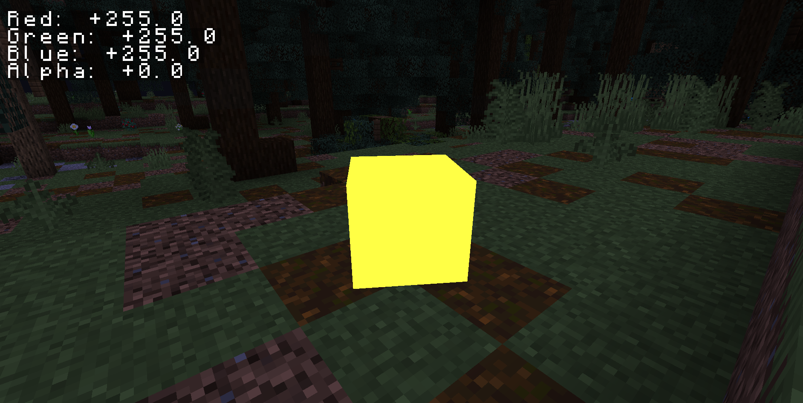
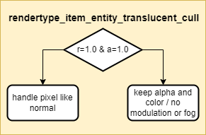
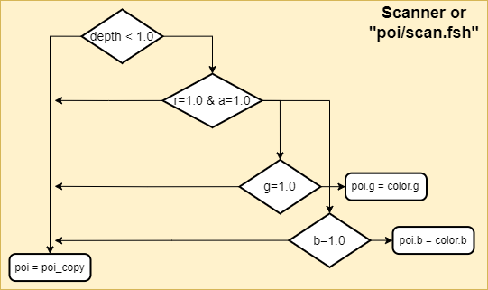
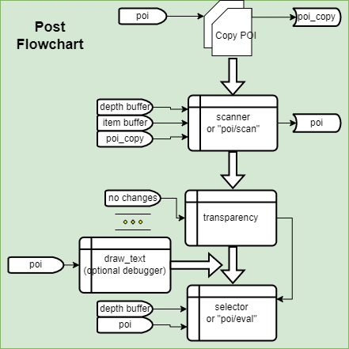

# Shader Selector (Minecraft Resource Pack)
<!-- ALL-CONTRIBUTORS-BADGE:START - Do not remove or modify this section -->

<!-- ALL-CONTRIBUTORS-BADGE:END -->

## Flashlight Example 💡
<!-- prettier-ignore-start -->
<!-- markdownlint-disable -->
  
In the "flashlight" example files, right clicking a warped fungus on a stick causes the flashlight to turn on/off. While the flashlight is on "battery" scoreboard is drained, and as it goes down the overlay in the top left corner indicates battery level. This example demonstrates the two channel handling. The battery display can operate independent of the flashlight as it is on the Blue channel and the flashlight is on the Green.  
Note: In the datapack, it constantly tries to apply the shader (every 1s). This is due to some slight inconsistencies with the system. It may be possible to spawn the item differently or make the core model smaller, or larger, to make it more consistent but that was not fully explored.  
<!-- markdownlint-enable -->
<!-- prettier-ignore-end -->

## How to Use 📝
<!-- prettier-ignore-start -->
<!-- markdownlint-disable -->
To use this pack, download the shader pack and go to "minecraft/assets/shaders/program/poi/eval.fsh". You can then read poi.g and poi.b to perform shader operations based on the values of G and B. Assume that they are 255.0/255.0 by default. Additionally, an overlay variable was added if you want to add an overlay to the screen, just load a texture onto that variable before the mixing line at the bottom of the file.  
In game, making the player have an item in their center crosshair will send the shader the data. This can be done with summon or give. The item you need is:
"/give @p white_stained_glass{CustomModelData:1GGGBBB}" where GGG and BBB are the value for G and B. One of the two must be 255, and the other will be send as input data to the shader. If summoning an item, it is suggested that it have pickup delay and an age close to 6000 (the ticks for an item to despawn).
<!-- markdownlint-enable -->
<!-- prettier-ignore-end -->

## How it Works! 🔨
<!-- prettier-ignore-start -->
<!-- markdownlint-disable -->
  
1. 3D Models of cubes of specific colors (R=255,G=X,B=Y,A=255) are used as inputs.  
  
2. A core shader ensures that the models have the same color on all sides, bypassing default color modulation.  
  
3. Item Buffer is read and if the color is R=255 and A=255, the post's buffer is updated based on the G and B values. If G or B is 255, it is not written to.  
  
4. Here is the overall "transparency.json" post program. It persists the Pixel of Interest (POI) buffer, ensuring it only changes when it sees something of interest. Also of note, the "transparency.json" program makes the alpha of items with R=255 zero, making the item invisible to users. 
<!-- markdownlint-enable -->
<!-- prettier-ignore-end -->

## Contributors 🧱
<!-- prettier-ignore-start -->
<!-- markdownlint-disable -->
<table>
  <tr>
    <td align="center"><a href="https://github.com/CloudWolfYT"> <b>Cloud Wolf</b></a> <a href="#" title="Project Creator">🔨</a></td>
    <td align="center"><a href=""> <b>The Der Discohund</b></a> <a href="#" title="Theory Contributor">💡</a></td>
    <td align="center"><a href=""> <b>RitikShah</b></a> <a href="#" title="Theory Contributor">💡</a></td>
    <td align="center"><a href=""> <b>Sir Benet</b></a> <a href="#" title="Draw Text Shader Debugger">💡</a></td>
  </tr>
</table>

<!-- markdownlint-enable -->
<!-- prettier-ignore-end -->
