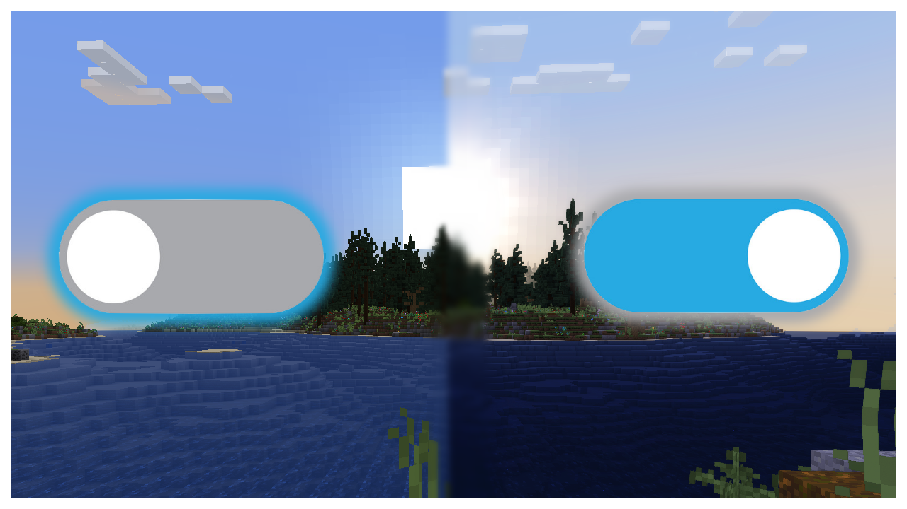

# Shader Selector V2 (Minecraft Resource Pack)
<!-- ALL-CONTRIBUTORS-BADGE:START - Do not remove or modify this section -->
[](#contributors-)
[](https://discord.gg/VzjQ7kFKqD)
[](https://www.youtube.com/watch?v=2RvUduq4L4Q)

<!-- ALL-CONTRIBUTORS-BADGE:END -->


## The Source Code for this was obtained from the example by Der Discohund:
https://github.com/HalbFettKaese/common-shaders

## Flashlight Example 💡
<!-- prettier-ignore-start -->
<!-- markdownlint-disable -->
 <br>
In the "flashlight" example files, right clicking a carrot on a stick causes the flashlight to turn on/off. While the flashlight is on "battery" scoreboard is drained, and as it goes down the overlay in the top left corner indicates battery level. This example demonstrates the two channel handling. The battery display can operate independent of the flashlight as it is on the Blue channel and the flashlight is on the Green. <br>
Note: The datapack implementation makes the flashlight multiplay friendly. <br>
<!-- markdownlint-enable -->
<!-- prettier-ignore-end -->

## How to Use 📝
<!-- prettier-ignore-start -->
<!-- markdownlint-disable -->
To use this pack, download the shader pack and go to "minecraft/assets/shaders/program/toggler/shader.fsh". A switch is implemented which triggers for cases of "blue" for channel 1 and 2 which lie at row 1 and 2 of the controller buffer. Row 0 contains a timer that counts up and can also be used if a timer is needed. Additionally, an overlay variable was added if you want to add an overlay to the screen, just load a texture onto that variable before the mixing line at the bottom of the file. <br>
Channel 1 is specified by R=255 and G=253, to change the B value of it use:
<!-- markdownlint-enable -->
```
particle minecraft:entity_effect ~ ~ ~ 0.9960784313725490196078431372549 0.9921568627450980392156862745098 B 1 0 force @s
```
<!-- markdownlint-disable -->
Channel 2 is specified by R=255 and G=252, to change the B value of it use:
<!-- markdownlint-enable -->
```
particle minecraft:entity_effect ~ ~ ~ 0.9960784313725490196078431372549 0.98823529411764705882352941176471 B 1 0 force @s
```
<!-- markdownlint-disable -->
<!-- markdownlint-enable -->
<!-- prettier-ignore-end -->

## How it Works! 🔨
<!-- prettier-ignore-start -->
<!-- markdownlint-disable -->
The particles core shader contains information about all particles displayed to the player. The entity_effect particle will appear in the buffer regardless of where it is played. For this reason, the core shader looks for particles whose color matches the R and G values, and those particles are put in the bottom left corner of the screen. From there, the transparency shader reads the value stored at the specific location on the particle buffer (0,1), and if it is correct it puts the color onto the control buffer in the location it is meant to go (row 1 for channel 1, row 2 for channel 2). Then the control buffer can be read by other program shaders to make decisions.<br>
<!-- markdownlint-enable -->
<!-- prettier-ignore-end -->

## Contributors 🧱
<!-- prettier-ignore-start -->
<!-- markdownlint-disable -->
<table>
  <tr>
    <td align="center"><a href="https://github.com/CloudWolfYT"><br /><sub><b>Cloud Wolf</b></sub></a><br /><a href="#" title="Project Creator">🔨</a></td>
    <td align="center"><a href=""><br /><sub><b>The Der Discohund / HalbFettKaese</b></sub></a><br /><a href="#" title="Theory Contributor">💡</a></td>
    <td align="center"><a href=""><br /><sub><b>RitikShah</b></sub></a><br /><a href="#" title="Theory Contributor">💡</a></td>
    <td align="center"><a href=""><br /><sub><b>Sir Benet</b></sub></a><br /><a href="#" title="Draw Text Shader Debugger">💡</a></td>
  </tr>
</table>

<!-- markdownlint-enable -->
<!-- prettier-ignore-end -->
